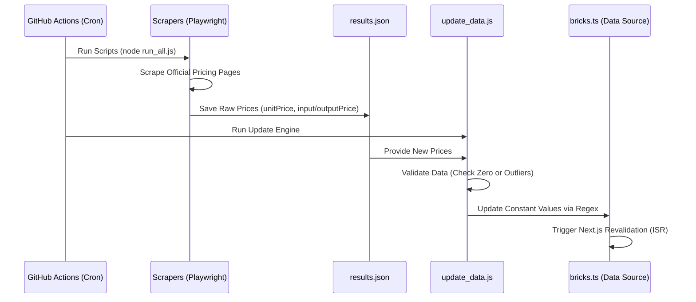

## 1. Aesthetic Score Logic (미학 점수 객관화)
- **설계 의도**: 주관적인 취향을 넘어선 '디자인 완성도'의 표준화된 지표 제공.
- **5대 평가 기준 (체크리스트)**:
  1. **Typography**: 가독성, 자간/행간, 폰트 선정의 적절성.
  2. **Dark Mode**: 딥 다크 테마의 대비감(Contrast) 및 글로우 효과의 세련미.
  3. **Micro-Interaction**: 버튼 호버, 로딩 스켈레톤, 페이지 전환의 부드러움.
  4. **API Console UI**: 개발자가 직접 대면하는 대시보드의 직관성과 심미성.
  5. **Visual Identity**: 일관된 컬러 스키마와 브랜드 아이덴티티의 유니크함.
- **운영**: 초기 관리자 평가 후, Phase 2부터 커뮤니티 투표(Upvote) 가중치 반영.

## 3. Stack Builder (비용 계산기) 엔진 로직
- **설계 의도**: 사용자가 AI 도구와 인프라를 조합할 때, 각기 다른 과금 단위(Token, GB, Req)를 무시하고 직관적인 '월 비용'을 실시간으로 확인하게 함.
- **표준화 공식**: `EstimatedCost = Math.max(0, (UsagePerUser * MAU * BaseUsage - FreeQuota)) * UnitPrice`
- **BaseUsage (가중치)**: 
  - 사용자가 조절하는 'Global Usage Slider'의 범용성을 확보하기 위한 도구별 보정값.
  - **Language**: 1,000 (기본 유저당 1천 토큰 사용 가정)
  - **Infra (DB)**: 0.01 (기본 유저당 10MB 사용 가정)
  - **Infra (Req)**: 100 (기본 유저당 100회 요청 가정)
- **상태 관리**: `Zustand` (Store) -> `CalculatorBar` (Component) -> `calculator.ts` (Logic) 순으로 데이터가 흐르며, 모든 입력 변화는 O(N) 복잡도로 즉시 합계에 반영됨.

## 4. i18n 및 SEO 전략
- **라우팅**: Middleware를 통해 브라우저 언어 감지 후 `/ko` 또는 `/en`으로 자동 배포.
- **데이터 구조**: `Bricks` 데이터를 `messages/[locale].json`에 키값으로 저장하여 툴 설명까지 완벽한 번역 지원.

## 6. Daily Tech Feed Logic (데일리 피드 로직)
- **데이터 구조**: 각 아이템에 `createdAt` 필드를 부여.
- **로직**:
  - 현재 날짜로부터 가장 최근에 등록된 N개의 아이템을 메인 최상단 "What's New Today" 섹션에 노출.
  - 날짜가 바뀔 때마다 자동으로 리스트가 갱신되는 정적 생성(ISR) 고려.

## 5. Pricing Pipeline 시퀀스 다이어그램

## 3. Data Harvest Pipeline (데이터 자동 업데이트)
- **핵심 알고리즘 (update_data.js)**:
  1. `results.json` 로드.
  2. `bricks.ts` 파일 내용을 문자열로 읽음.
  3. 각 도구 ID에 매칭되는 `pricing` 객체 내의 `unitPrice` 또는 `inputPrice/outputPrice`를 정규표현식으로 정밀 타격하여 치환.
  4. 데이터 안정성: `unitPrice === 0`일 경우 수집 오류로 간주하고 업데이트를 생략하는 Safety Guard 가동.
- **예외 처리 전략**:
  - **Selector Timeout**: Playwright 스크립트에서 셀렉터를 찾지 못할 경우 에러를 던지지 않고 로그만 남겨 전체 파이프라인 중단을 방지.
  - **Outlier Detection**: 이전 가격 대비 변동폭이 지나치게 클 경우 경고 로그 출력 (Phase 3 적용 예정).

## 4. Stack Builder Logic (Phase 2 완료)
- **설계**: 사용자가 카드의 'Add' 버튼을 누르면 `LocalStorage`에 영구 저장되어 새로고침 시에도 유지됨.
- **합계 계산**: 선택된 서비스들의 월간/연간 예상 비용을 실시간 합산하여 하단 플로팅 바에 표시.
- **환율 연동**: USD 기준가를 1,350원 고정 환율(Phase 3에서 실시간 API 연동 예정)로 변환하여 KRW 표기 지원.
