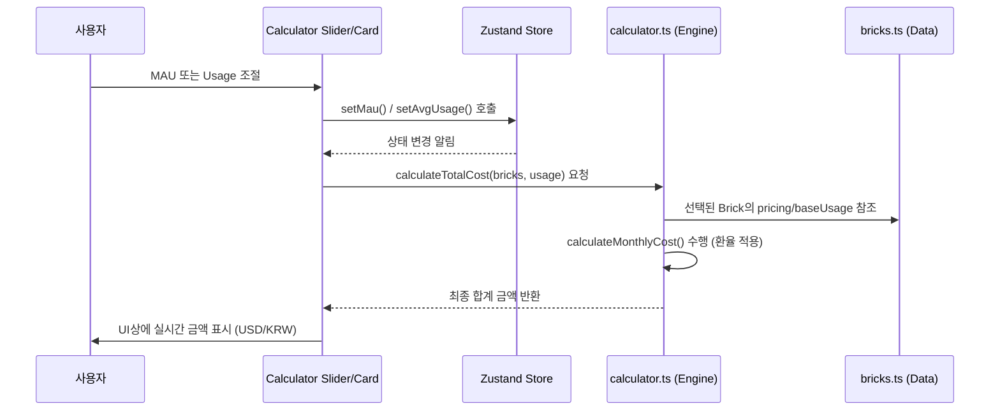

## 1. Aesthetic Score Logic (미학 점수 객관화)
- **설계 의도**: 주관적인 취향을 넘어선 '디자인 완성도'의 표준화된 지표 제공.
- **5대 평가 기준 (체크리스트)**:
  1. **Typography**: 가독성, 자간/행간, 폰트 선정의 적절성.
  2. **Dark Mode**: 딥 다크 테마의 대비감(Contrast) 및 글로우 효과의 세련미.
  3. **Micro-Interaction**: 버튼 호버, 로딩 스켈레톤, 페이지 전환의 부드러움.
  4. **API Console UI**: 개발자가 직접 대면하는 대시보드의 직관성과 심미성.
  5. **Visual Identity**: 일관된 컬러 스키마와 브랜드 아이덴티티의 유니크함.
- **운영**: 초기 관리자 평가 후, Phase 2부터 커뮤니티 투표(Upvote) 가중치 반영.

## 3. Stack Builder (비용 계산기) 엔진 로직
- **설계 의도**: 사용자가 AI 도구와 인프라를 조합할 때, 각기 다른 과금 단위(Token, GB, Req)를 무시하고 직관적인 '월 비용'을 실시간으로 확인하게 함.
- **핵심 알고리즘 (`calculateMonthlyCost`)**:
  1. **총 원천 사용량 산출**: `TotalRawUsage = MAU * AvgUsagePerUser * BaseUsage`
     *   `MAU`: 전역 상태에서 관리되는 월간 활성 사용자 수.
     *   `AvgUsagePerUser`: 유저 1인당 기본 사용 강도 (슬라이더 값).
     *   `BaseUsage`: 각 브릭별 고유 가중치 (예: Language는 1000, DB는 0.01).
  2. **무료 티어 차감**: `TaxableUsage = Math.max(0, TotalRawUsage - FreeQuota)`
  3. **요금 체계별 최종가 계산**:
     *   `token`: `(TaxableUsage / 1,000,000) * ((InputPrice + OutputPrice) / 2)`
     *   `request` & `infra`: `TaxableUsage * UnitPrice`
     *   `subscription`: `MonthlyPrice` (사용량 무관 고정)

- **BaseUsage (가중치) 적용 사례**: 
  - **Language (GPT/Claude)**: `1.0` (기본값) -> 유저당 1회 사용 시 약 1,000 토큰 발생으로 스케일링.
  - **Infra (Supabase DB)**: `0.01` -> 유저당 10MB(0.01GB)의 저장 공간 점유 가정.
  - **Infra (Upstash Redis)**: `10` -> 유저당 10회 호출 발생 가정.

- **상태 관리 및 흐름**: 
  - `Zustand` 스토어(`useStackStore`)에서 `selectedBrickIds`, `mau`, `avgUsagePerUser`를 관리.
  - UI 컴포넌트는 `useMemo`를 통해 `calculateTotalCost`를 호출하며, 의존성 배열에 스토어 상태를 바인딩하여 실시간성(O(N)) 보장.

## 4. Calculation Flow 시퀀스 다이어그램

## 5. i18n 및 SEO 전략
- **라우팅**: Middleware를 통해 브라우저 언어 감지 후 `/ko` 또는 `/en`으로 자동 배포.
- **데이터 구조**: `Bricks` 데이터를 `messages/[locale].json`에 키값으로 저장하여 툴 설명까지 완벽한 번역 지원.

## 6. Daily Tech Feed Logic (데일리 피드 로직)
- **데이터 구조**: 각 아이템에 `createdAt` 필드를 부여.
- **로직**:
  - 현재 날짜로부터 가장 최근에 등록된 N개의 아이템을 메인 최상단 "What's New Today" 섹션에 노출.
  - 날짜가 바뀔 때마다 자동으로 리스트가 갱신되는 정적 생성(ISR) 고려.

## 7. Pricing Harvest Pipeline (데이터 자동 업데이트)
- **핵심 알고리즘 (update_data.js)**:
  1. `results.json` 로드.
  2. `bricks.ts` 파일 내용을 문자열로 읽음.
  3. 각 도구 ID에 매칭되는 `pricing` 객체 내의 `unitPrice` 또는 `inputPrice/outputPrice`를 정규표현식으로 정밀 타격하여 치환.
- **예외 처리 전략**:
  - **Selector Timeout**: Playwright 스크립트에서 셀렉터를 찾지 못할 경우 로그만 남겨 전체 파이프라인 중단을 방지.
  - **Safety Guard**: 이전 가격 대비 변동폭이 2배 이상일 경우 수동 검토 플래그 생성 (Phase 3).
