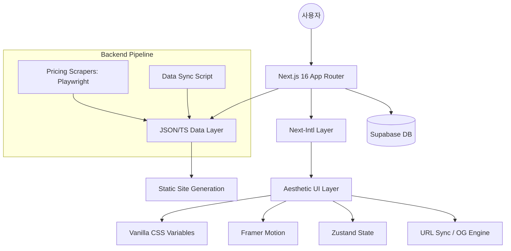

# SYSTEM MAP (LegoStack 프로젝트 구조도)

## 🏗️ 전체 아키텍처


## 🛠️ 기술 스택 상세
- **Framework**: Next.js 16.2.4 (App Router)
- **Language**: TypeScript 5.x
- **i18n**: Next-Intl (Prefix-based: `/ko`, `/en`)
- **Database**: Supabase (Shared Stacks & Metadata)
- **Styling**: Vanilla CSS (Global Variables + Module CSS)
- **Animation**: Framer Motion 12.x
- **State Management**: Zustand 5.x
- **Data Layer**: `/src/data/*.ts` (bricks.ts, presets.ts)
- **Automation**: Playwright (Price Scraping)
- **Utilities**: LZ-String (Query Compression), Html-to-image (OG generation helper)
- **Deployment**: Vercel

## 📂 폴더 구조
```text
/stack
├── .gravityBrain/          # 에이전트 장기 기억 저장소
├── .github/workflows/      # 자동화 워크플로우 (가격 스크래핑 등)
├── /scripts
│   └── /scraper            # 가격 수집 엔진 (Playwright 기반)
├── /src
│   ├── /app                # Next.js App Router (Routing, Layouts, API)
│   │   ├── /[locale]       # 다국어 라우팅
│   │   │   ├── /blog       # MDX 블로그 시스템
│   │   │   ├── /compare    # A vs B 비교 페이지 (SEO)
│   │   │   ├── /category   # 카테고리별 쇼케이스 (SEO)
│   │   │   ├── /brick      # 개별 도구 상세 페이지
│   │   │   └── /s          # 공유 스택 전용 랜딩 페이지
│   │   └── /api            # Backend APIs (OG, Share, Redirect)
│   ├── /components         # UI 컴포넌트 (Atomic Design 컨셉)
│   ├── /data               # 핵심 데이터 (서비스 목록, 가격 정책, 프리셋)
│   ├── /hooks              # 커스텀 훅 (Sync, UI logic)
│   ├── /i18n               # i18n 설정 및 요청 처리
│   ├── /lib                # 비즈니스 로직 (비용 계산기, Supabase, Serialize)
│   ├── /messages           # 다국어 번역 리소스 (ko.json, en.json)
│   ├── /store              # Zustand 스토어 (사용자 선택 스택 상태)
│   └── proxy.ts            # 외부 요청 프록시 레이어
├── /public                 # 정적 자산 (이미지, 로고)
└── package.json            # 의존성 및 프로젝트 설정
```

## 🔗 핵심 모듈 및 데이터 흐름
1. **데이터 수집 (Scripts)**: `scripts/scraper`가 Playwright를 통해 OpenAI, Anthropic 등의 최신 가격을 수집하여 `src/data`의 상수를 업데이트합니다.
2. **다국어 처리 (i18n)**: `src/messages`의 번역본이 `next-intl`을 통해 UI에 주입되며, `/ko`, `/en` 등의 경로로 관리됩니다.
3. **비용 계산 로직 (Lib/Store)**: 사용자가 UI에서 선택한 스택 정보가 `Zustand` 스토어에 저장되고, `lib/calculator.ts` 엔진이 실시간으로 합산 비용을 산출합니다.
4. **공유 및 동기화 (Sync/Supabase)**: 
   - `serialize.ts`와 `LZ-String`을 사용하여 스택 상태를 압축된 URL 쿼리로 변환합니다.
   - `api/share`를 통해 긴 설정을 Supabase에 저장하고 짧은 ID로 변환하여 공유 가능하게 합니다.
5. **프리젠테이션 (UI)**: `Framer Motion`과 `Vanilla CSS`를 활용하여 고급스러운 인터랙션과 디자인을 제공합니다.
6. **실시간 OG 이미지**: `api/og`에서 유저의 선택 스택을 반영한 동적 OG 이미지를 생성하여 SNS 공유 시 시각적 효과를 극대화합니다.
7. **SEO 유입 최적화 (Compare/Category/Detail)**: 
   - 특정 검색어(A vs B, Best Tools)를 겨냥한 전용 페이지를 자동 생성합니다.
   - **개별 상세 페이지(`/brick/[id]`)**: 22개 도구에 대해 Description, Pros/Cons, Use Cases 등 풍부한 콘텐츠와 JSON-LD를 적용하여 'Thin Content' 문제를 해결하고 검색 순위를 높입니다.
8. **권위 확립 (Blog & RSS)**: 
   - MDX 기반 기술 블로그를 통해 AI FinOps 전문가 이미지를 구축하고 정보성 트래픽을 유도합니다.
   - **RSS 피드(`/rss.xml`)**: 블로그 업데이트를 검색 엔진 및 피드 리더에 실시간 전파하여 재방문율을 높입니다.
9. **성능 기반 추천 (Efficiency Engine)**: 
   - 단순 가격 비교를 넘어 MMLU 등 공인 벤치마크 데이터를 비용과 결합하여 '가장 가성비 좋은 도구'를 산출합니다.
