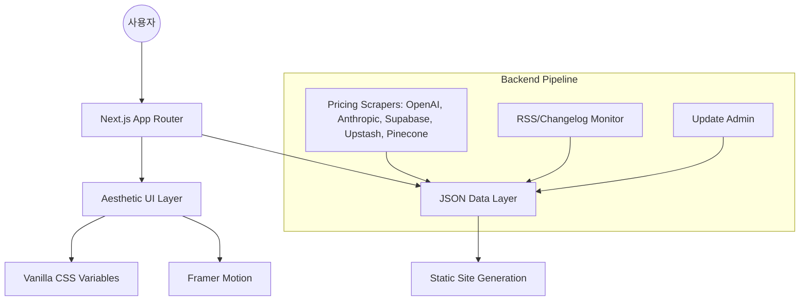

# SYSTEM MAP (LegoStack 프로젝트 구조도)

## 🏗️ 전체 아키텍처


## 🛠️ 기술 스택 상세
- **Framework**: Next.js 14 (App Router)
- **Language**: TypeScript
- **i18n**: Next-Intl (Prefix-based routing: `/ko`, `/en`)
- **Styling**: Vanilla CSS (Global Variables + Module CSS)
- **Animation**: Framer Motion (Micro-interactions)
- **Data Source**: `/data/*.json` (정적 파일)
- **SEO**: Metadata API + JSON-LD + Sitemap.xml
- **Rendering**: ISR (Incremental Static Regeneration - `revalidate: 3600`)
- **Deployment**: Vercel

## 📂 폴더 구조 설계 (Draft)
```text
/stack
├── .gravityBrain/          # 시스템 기억 저장소 (MEMORY, SYSTEM_MAP 등)
├── .github/workflows/      # CI/CD 및 가격 자동 업데이트 워크플로우
├── /scripts
│   ├── /scraper            # AI 및 인프라 가격 수집 스크래퍼 (Playwright)
│   │   ├── results.json    # 수집된 원시 가격 데이터
│   │   └── update_data.js  # bricks.ts에 데이터를 반영하는 엔진
│   └── /seo                # 검색 엔진 인덱싱 및 SEO 유틸리티
├── /src
│   ├── /app                # Next.js App Router (i18n 라우팅 포함)
│   ├── /components         # UI Components (Calculator, BrickGrid 등)
│   ├── /data               # 정적 데이터 (bricks.ts, presets.ts)
│   ├── /lib                # 계산기 엔진 및 유틸리티 함수
│   ├── /store              # Zustand 상태 관리 (사용자 스택 정보)
│   └── /styles             # Global CSS Variables 및 디자인 시스템
├── /public                 # 정적 에셋 (아이콘, 파비콘)
└── next.config.ts          # Next.js 설정 및 환경 변수
```

## 🔗 모듈 간 관계
- **Scraper ➔ Data**: Playwright가 수집한 가격 정보가 `results.json`을 거쳐 `bricks.ts` 상의 가격 상수를 실시간으로 업데이트.
- **Data ➔ UI**: `bricks.ts`의 정적 데이터를 Next.js ISR을 통해 SEO 최적화된 HTML로 사전 렌더링.
- **Store ➔ Calculator**: Zustand 스토어에 저장된 `MAU`, `Usage` 상태가 `CalculatorBar`에 실시간 반영되어 합계 비용 계산.
- **i18n ➔ App**: `next-intl` 미들웨어가 `/ko`, `/en` 경로에 따라 적절한 번역 메시지(`ko.json`, `en.json`) 주입.
- **Security ➔ External**: 외부 서비스 링크는 Proxy Redirect 시스템을 통해 트래킹 및 보안 정책(`noopener`) 적용.
