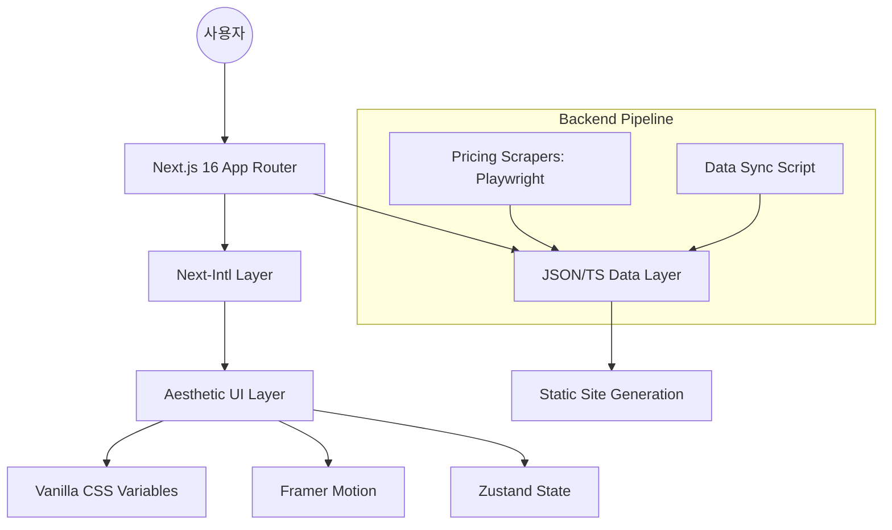

# SYSTEM MAP (LegoStack 프로젝트 구조도)

## 🏗️ 전체 아키텍처


## 🛠️ 기술 스택 상세
- **Framework**: Next.js 16.2 (App Router)
- **Language**: TypeScript 5.x
- **i18n**: Next-Intl (Prefix-based: `/ko`, `/en`)
- **Styling**: Vanilla CSS (Global Variables + Module CSS)
- **Animation**: Framer Motion 12.x
- **State Management**: Zustand 5.x
- **Data Layer**: `/src/data/*.ts` (bricks.ts, presets.ts)
- **Automation**: Playwright (Price Scraping)
- **Deployment**: Vercel (Expected)

## 📂 폴더 구조
```text
/stack
├── .gravityBrain/          # 에이전트 장기 기억 저장소
├── .github/workflows/      # 자동화 워크플로우 (가격 스크래핑 등)
├── /scripts
│   └── /scraper            # 가격 수집 엔진 (Playwright 기반)
├── /src
│   ├── /app                # Next.js App Router (Routing, Layouts)
│   ├── /components         # UI 컴포넌트 (Atomic Design 컨셉)
│   ├── /data               # 핵심 데이터 (서비스 목록, 가격 정책, 프리셋)
│   ├── /i18n               # i18n 설정 및 요청 처리
│   ├── /lib                # 비즈니스 로직 (비용 계산기 엔진, 유틸리티)
│   ├── /messages           # 다국어 번역 리소스 (ko.json, en.json)
│   └── /store              # Zustand 스토어 (사용자 선택 스택 상태)
├── /public                 # 정적 자산 (이미지, 로고)
└── package.json            # 의존성 및 프로젝트 설정
```

## 🔗 핵심 모듈 및 데이터 흐름
1. **데이터 수집 (Scripts)**: `scripts/scraper`가 Playwright를 통해 OpenAI, Anthropic 등의 최신 가격을 수집하여 `src/data`의 상수를 업데이트합니다.
2. **다국어 처리 (i18n)**: `src/messages`의 번역본이 `next-intl`을 통해 UI에 주입되며, `/ko`, `/en` 등의 경로로 관리됩니다.
3. **비용 계산 로직 (Lib/Store)**: 사용자가 UI에서 선택한 스택 정보가 `Zustand` 스토어에 저장되고, `lib`의 계산 엔진이 실시간으로 합산 비용을 산출합니다.
4. **프리젠테이션 (UI)**: `Framer Motion`과 `Vanilla CSS`를 활용하여 고급스러운 인터랙션과 디자인을 제공합니다.
5. **실시간 공유 시스템 (Sync/OG)**: `src/lib/serialize.ts`를 통해 스토어 상태를 URL 쿼리 스트링으로 실시간 동기화하며, `api/og`를 통해 동적 OG 이미지를 생성하여 바이럴 효과를 극대화합니다.
6. **검색 최적화 (SEO)**: Next.js의 Metadata API와 정적 생성을 통해 개발자 도구 키워드 노출을 극대화합니다.
